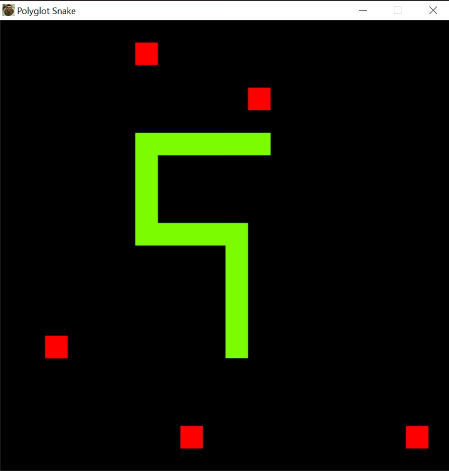

  

## The Challenge
Code Snake, but the source code is valid in both Python and C++.  

Rules:
1. The languages must be independent of each other
   - You can't do shit like in [`gay-version-1.cpp`](https://github.com/WAP-Industries/Polyglot-Snake/blob/main/gay-version-1.cpp), where Python is relying on existing g++ capabilities to compile the C++ code
   - Essentially, each language must run its own version of Snake
2. You cannot have two separate full source codes for each language
   - A solution like in [`gay-version-2.cpp`](https://github.com/WAP-Industries/Polyglot-Snake/blob/main/gay-version-2.cpp) would be too easy otherwise
   - You code must look like one full program, so you need to combine the C++ and Python code as much as possible

---

## Compilation
- C++
    - Run `main.exe` or ...
    - Run `& .\compile.ps1` in your powershell terminal
- Python
    - Run `python main.cpp` in your terminal 
